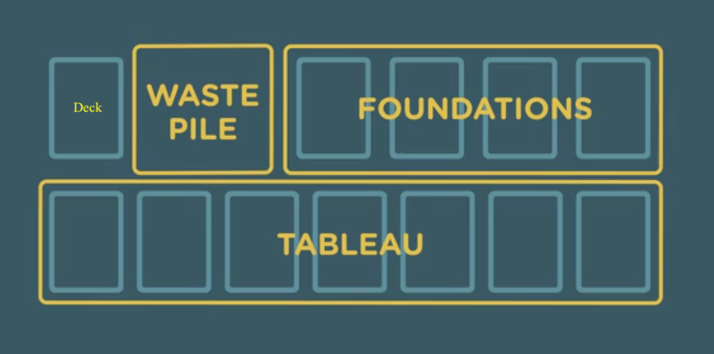
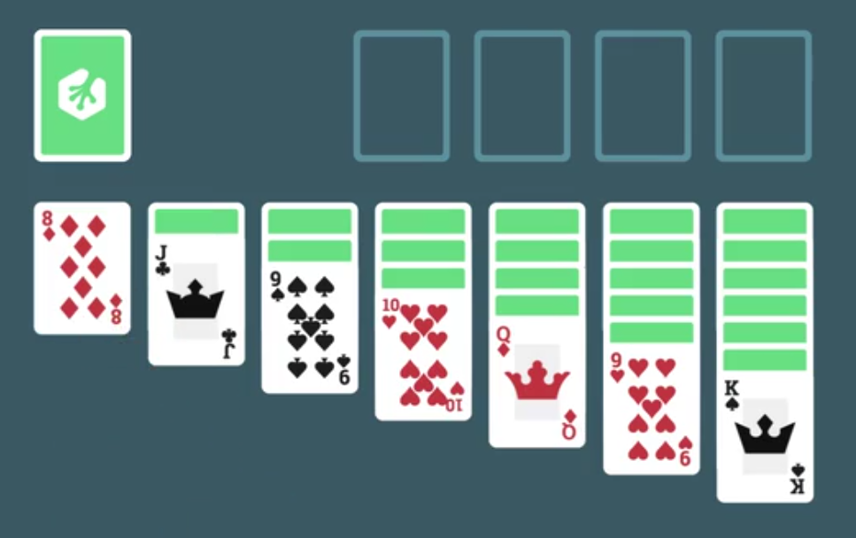
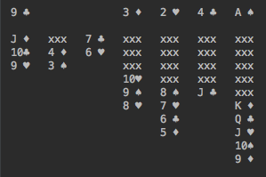

# Solitaire game in Kotlin
---

## Inspriration
- Originally forked and reproduced steps by steps from https://github.com/treehouse/SolitaireKotlin
- Thanks @bfdeitch for awesome tutorial!

## Project

### Structure
- This project is loaded and run with ItelliJ IDEA with KotlinJavaRuntime

### Purpose
- Create a Solitaire game with Card, Deck, Foundation Pile, Tableau Pile, Waste Pile and their behavior.

- The original view of a Solitaire game (images taken from the tutorial Treehouse itself, I claim no copyright.)

- The final view of Solitaire in Kotlin as below

 

### Run the code
- Compile and run the `App.kt` or `test/GameTest.kt`
